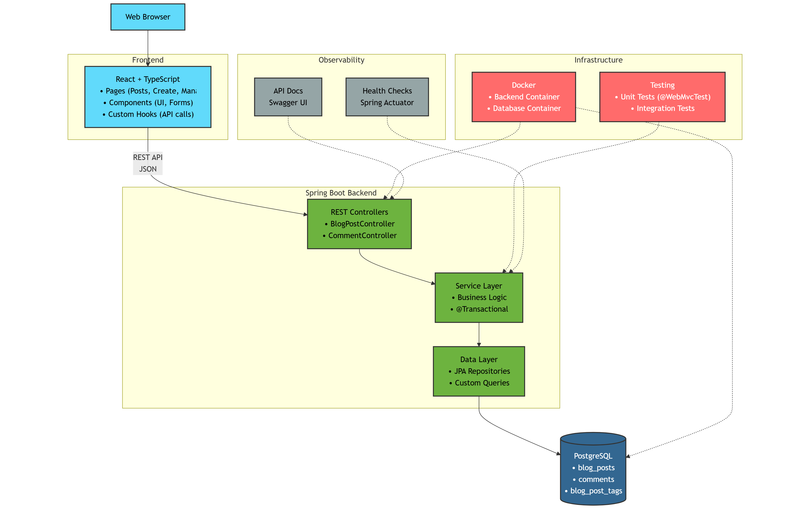

# BlogApp - Modern Blog Platform

A comprehensive full-stack blog application built with React and Spring Boot. This platform enables users to create, manage, and engage with blog content through a modern, responsive interface.

## 🚀 Features

### Core Functionality
- **Blog Post Management** - Create, edit, update, and delete blog posts with rich content
- **Comment System** - Interactive commenting with real-time engagement
- **Advanced Search & Filtering** - Search by keyword, author, tags, and status
- **Post Status Management** - Draft, Published, and Archived states
- **Tag System** - Organize posts with customizable tags
- **Responsive Design** - Mobile-friendly interface with modern UI/UX

### Enterprise Features
- **Comprehensive CRUD Operations** - Full blog post and comment management
- **Advanced Search & Filtering** - By keyword, author, tags, status
- **Caching Strategy** - Multi-level caching with Redis support
- **Global Exception Handling** - Centralized error management
- **API Documentation** - Swagger/OpenAPI integration
- **Database Optimization** - Indexing and query optimization
- **Testing Suite** - Unit and integration tests
- **Monitoring & Metrics** - Health checks and custom metrics
- **Security** - Input validation and rate limiting
- **Docker Support** - Containerization and orchestration

## 🏗️ Architecture



### Backend (Spring Boot)
- **Framework**: Spring Boot 3.5.3 with Java 24
- **Database**: PostgreSQL with JPA/Hibernate
- **Security**: Spring Security with HTTP Basic Authentication
- **API Documentation**: Swagger/OpenAPI 3
- **Testing**: JUnit 5 with Spring Boot Test
- **Build Tool**: Maven
- **Containerization**: Docker with multi-stage builds

### Frontend (React)
- **Framework**: React 18 with TypeScript
- **Styling**: Bootstrap CSS with responsive design
- **Build Tool**: Create React App
- **API Communication**: Axios with centralized error handling
- **Containerization**: Docker with Nginx serving

### Database Schema
- **blog_posts**: Main blog post entities with title, content, author, status, tags
- **comments**: Comment entities linked to blog posts
- **blog_post_tags**: Tag storage for categorization

## 🛠️ Technology Stack

### Backend Dependencies
- Spring Boot Starter Web
- Spring Boot Starter Data JPA
- Spring Boot Starter Validation
- Spring Boot Starter Security
- Spring Boot Starter Test
- PostgreSQL Driver
- MapStruct for DTO mapping
- SpringDoc OpenAPI for API documentation
- Spring Boot Actuator for monitoring

### Frontend Dependencies
- React & React DOM
- TypeScript
- Bootstrap CSS (SCSS)
- Axios for API calls
- React Router for navigation

## 📦 Installation & Setup

### Prerequisites
- Java 24 or higher
- Node.js 16+ and npm
- PostgreSQL 13+
- Docker and Docker Compose (optional)

### Option 1: Docker Setup (Recommended)

1. **Clone the repository**
```bash
git clone <repository-url>
cd blogapp
```

2. **Backend Setup**
```bash
cd backend
docker-compose up -d
```

3. **Frontend Setup**
```bash
cd ../frontend
npm install
npm start
```

### Option 2: Local Development Setup

#### Backend Setup
1. **Navigate to backend directory**
```bash
cd backend
```

2. **Set up PostgreSQL database**
```sql
CREATE DATABASE blogdb;
CREATE USER bloguser WITH PASSWORD 'your-password';
GRANT ALL PRIVILEGES ON DATABASE blogdb TO bloguser;
```

3. **Configure environment variables**
```bash
export DB_PASSWORD=your-password
# Or create application-local.properties
```

4. **Run the application**
```bash
./mvnw spring-boot:run
```

#### Frontend Setup
1. **Navigate to frontend directory**
```bash
cd frontend
```

2. **Install dependencies**
```bash
npm install
```

3. **Configure environment variables**
```bash
# Create .env file
REACT_APP_API_URL=http://localhost:8080/api/v1
```

4. **Start the development server**
```bash
npm start
```

## 🐳 Docker Configuration

### Backend Container
- **Base Image**: OpenJDK 24
- **Multi-stage build** for optimized production image
- **Non-root user** for security
- **Health checks** included

### Frontend Container
- **Base Image**: Node.js 22 Alpine for building, Nginx Alpine for serving
- **Multi-stage build** for minimal production image
- **Nginx configuration** for SPA routing
- **Non-root user** for security

### Docker Compose Services
- **postgres**: PostgreSQL database with persistent volume
- **backend**: Spring Boot application
- **frontend**: React application with Nginx

## 🔧 Configuration

### Backend Configuration Profiles
- **default**: Local development with PostgreSQL
- **docker**: Docker container configuration
- **test**: H2 in-memory database for testing
- **prod**: Production configuration with security hardening

### Environment Variables
```bash
# Database
DB_HOST=localhost
DB_PORT=5432
DB_NAME=blogdb
DB_USERNAME=bloguser
DB_PASSWORD=your-password

# Application
SPRING_PROFILES_ACTIVE=docker
```

### API Endpoints

#### Blog Posts
- `GET /api/v1/posts` - Get paginated posts
- `GET /api/v1/posts/{id}` - Get post by ID
- `POST /api/v1/posts` - Create new post
- `PUT /api/v1/posts/{id}` - Update post
- `DELETE /api/v1/posts/{id}` - Delete post
- `GET /api/v1/posts/search` - Search posts

#### Comments
- `GET /api/v1/comments/post/{postId}` - Get comments for post
- `POST /api/v1/comments/post/{postId}` - Create comment
- `PUT /api/v1/comments/{id}` - Update comment
- `DELETE /api/v1/comments/{id}` - Delete comment

Detailed API endpoints are available [here](backend/README.md).

## 🧪 Testing

### Backend Testing
```bash
cd backend
./mvnw test
```

## 📊 Monitoring & Health Checks

### Actuator Endpoints
- **Health Check**: `GET /actuator/health`
- **Application Info**: `GET /actuator/info`
- **Metrics**: `GET /actuator/metrics`

### API Documentation
- **Swagger UI**: http://localhost:8080/swagger-ui.html
- **OpenAPI Spec**: http://localhost:8080/v3/api-docs

## 🔐 Security Features

- **Input Validation** - Comprehensive validation using Bean Validation
- **HTTP Basic Authentication** - Simple authentication for API endpoints
- **CORS Configuration** - Cross-origin request handling
- **SQL Injection Prevention** - JPA/Hibernate query protection
- **XSS Protection** - Content sanitization
- **Security Headers** - Comprehensive security headers

## 🚦 Production Deployment

### Database Migration
```bash
# Production uses validate mode - ensure schema is up to date
./mvnw flyway:migrate -Pprod
```

### Environment Configuration
```bash
# Production environment variables
export SPRING_PROFILES_ACTIVE=prod
export DB_HOST=your-prod-db-host
export DB_PASSWORD=your-secure-password
```

## 📚 Development Guide

### Core Design Patterns
- **Dependency Injection** - Constructor injection throughout
- **Repository Pattern** - Custom queries with JPA repositories
- **Service Layer Pattern** - Interface-based services with implementations
- **DTO Pattern** - Data transfer objects with MapStruct mapping
- **Builder Pattern** - For complex object construction
- **Specification Pattern** - Dynamic query building

### Code Structure
```
backend/
├── src/main/java/com/blogpostapp/backend/
│   ├── config/          # Configuration classes
│   ├── controller/      # REST controllers
│   ├── dto/            # Data transfer objects
│   ├── entity/         # JPA entities
│   ├── exception/      # Custom exceptions
│   ├── mapper/         # MapStruct mappers
│   ├── repository/     # Data repositories
│   └── service/        # Business logic services
├── src/main/resources/  # Configuration files
└── src/test/           # Test classes

frontend/
├── src/
│   ├── components/     # Reusable UI components
│   ├── pages/         # Page components
│   ├── services/      # API service layer
│   ├── types/         # TypeScript definitions
│   └── utils/         # Utility functions
└── public/            # Static assets
```

## 🐛 Troubleshooting

### Common Issues

1. **Application won't start**
```bash
# Check logs
docker-compose logs backend

# Verify database connection
docker exec blogapp-postgres pg_isready -U bloguser -d blogdb
```

2. **Database connection issues**
```bash
# Check if containers are on same network
docker network ls
docker network inspect backend_blogapp-network
```

3. **API endpoints not responding**
```bash
# Check health endpoint
curl http://localhost:8080/actuator/health

# Verify API is running
curl http://localhost:8080/api/v1/posts
```

### Database Operations
```bash
# Connect to database
docker exec -it blogapp-postgres psql -U bloguser -d blogdb

# Common queries
SELECT COUNT(*) FROM blog_posts;
SELECT * FROM blog_posts ORDER BY created_at DESC LIMIT 5;
```

---

**Built with ❤️ using Spring Boot, React, and PostgreSQL**
